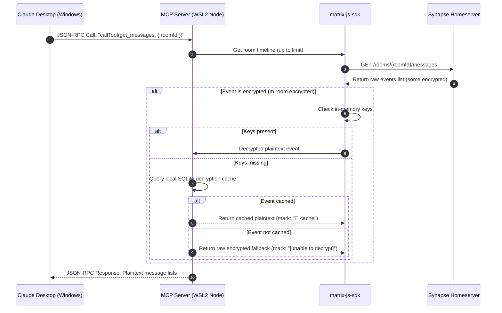
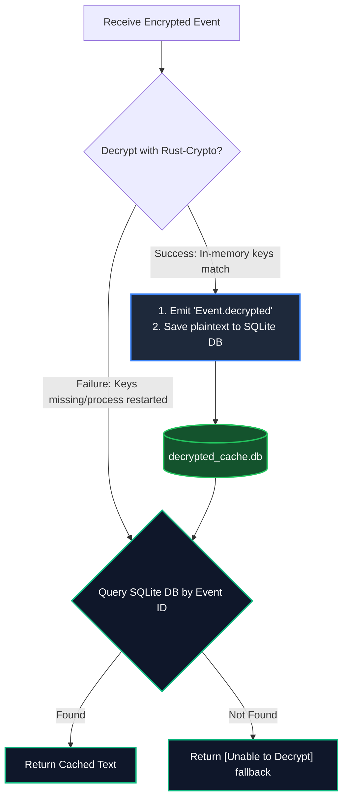
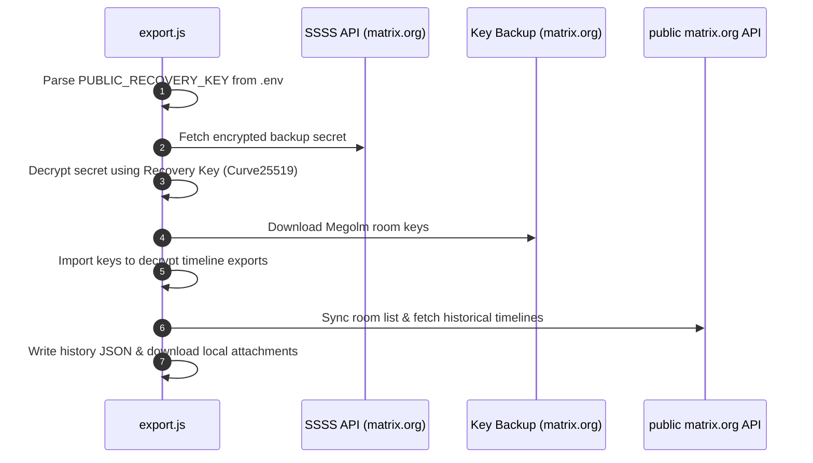
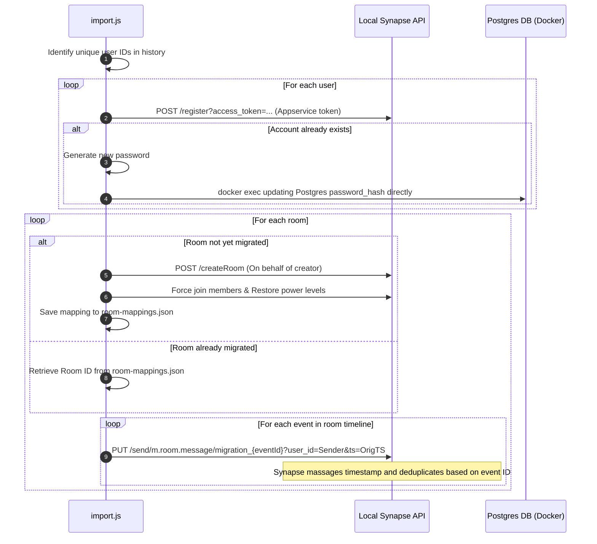

# Architecture & Feature Workflows

This document details the architectural design, component communication flows, and core workflows of the Matrix Selfhost project, including the Claude Desktop MCP Server, SQLite Decryption Cache, and the Public-to-Private Migration Pipeline.

---

## 1. System Components

The project consists of three main service layers:

```
┌────────────────────────────────────────────────────────┐
│               Windows Desktop Environment             │
│  ┌───────────────────┐        ┌─────────────────────┐  │
│  │  Claude Desktop   │◄───────►│    Element Client   │  │
│  └─────────┬─────────┘        └──────────▲──────────┘  │
└────────────┼─────────────────────────────┼─────────────┘
             │ stdio / JSON-RPC            │ HTTP (E2EE)
┌────────────┼─────────────────────────────┼─────────────┐
│            ▼                             ▼             │
│  ┌───────────────────┐        ┌─────────────────────┐  │
│  │    MCP Server     │───────►│  Synapse Homeserver │  │
│  │   (mcp-server/)   │  HTTP  │      (synapse/)     │  │
│  └─────────┬─────────┘        └──────────┬──────────┘  │
│            │                             │             │
│            ▼ SQLite                      ▼ PostgreSQL  │
│  ┌───────────────────┐        ┌─────────────────────┐  │
│  │ Decryption Cache  │        │   Postgres Database │  │
│  │ (decrypted_cache) │        │     (postgres/)     │  │
│  └───────────────────┘        └─────────────────────┘  │
│                   WSL2 Environment                     │
└────────────────────────────────────────────────────────┘
```

---

## 2. Component Workflows

### A. Claude Desktop Tool Execution (MCP Server)
The Model Context Protocol (MCP) server acts as a translator between Claude Desktop (stdio/JSON-RPC) and the Synapse Matrix API.



---

## 3. E2EE Cache System (Hybrid Storage)

To handle End-to-End Encryption (E2EE) securely and persist decrypted histories across server restarts, the MCP server utilizes a **Hybrid Memory + SQLite caching layer**.



---

## 4. History Migration Pipeline

The migration pipeline transfers room states, user accounts, and messages from a public homeserver to your private instance.

### A. Export Workflow (export.js)
Retrieves encrypted Megolm keys and room histories from the public server.



### B. Import Workflow (import.js)
Pre-creates users, resolves conflicts, and replays histories idempotently.



---

## 5. Security & Isolation

### Stdio & stdout protection
Since the MCP server communicates with Claude Desktop over standard input/output (`stdio`), **no process logging is allowed to touch stdout**. 
* Any standard node console logs (`console.log`) are redirected to `stderr` or local log files.
* This ensures that binary JSON-RPC communications between Claude Desktop and Node.js remain completely clean, preventing parser crashes.

### Database isolation
The local SQLite database (`mcp-server/decrypted_cache.db`) and user credentials file (`migration/data/new-user-credentials.txt`) contain sensitive decrypted contents and are excluded from Git repository tracking via `.gitignore`.
